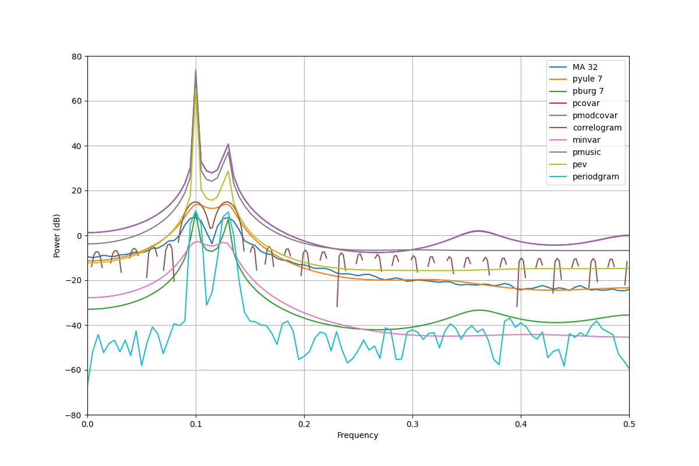
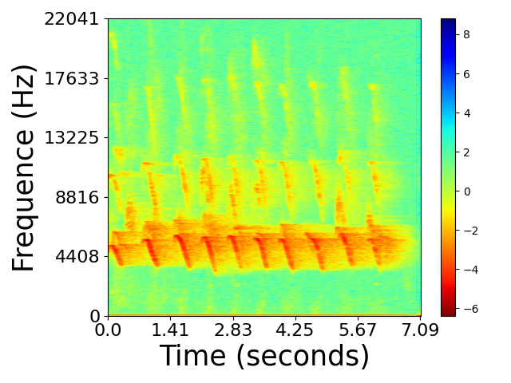
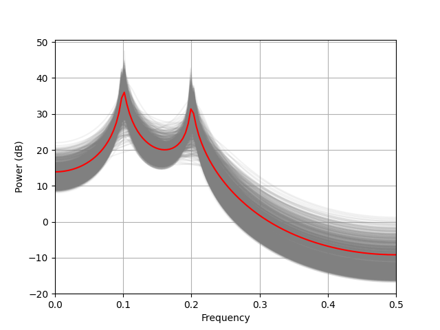
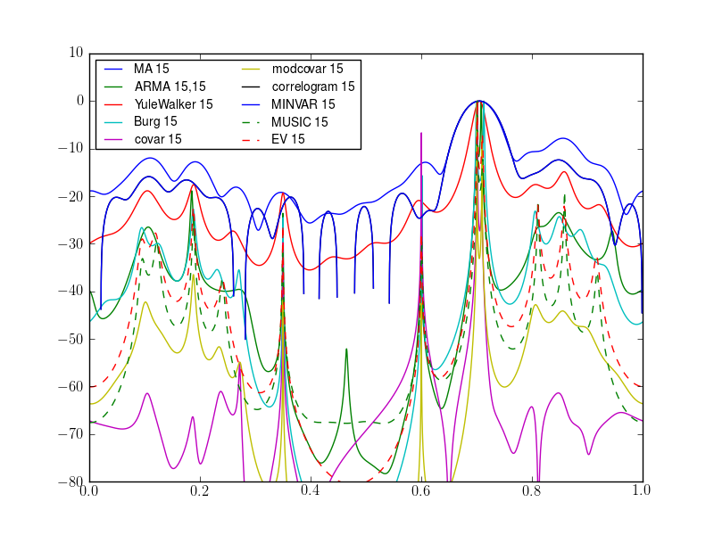

.. rubric:: Spectrum: a Spectral Analysis Library in Python

.. image:: https://badge.fury.io/py/spectrum.svg
    :target: https://pypi.python.org/pypi/spectrum

.. image:: https://secure.travis-ci.org/cokelaer/spectrum.png
    :target: http://travis-ci.org/cokelaer/spectrum

.. image:: https://coveralls.io/repos/cokelaer/spectrum/badge.png?branch=master 
    :target: https://coveralls.io/r/cokelaer/spectrum?branch=master 

.. image:: https://anaconda.org/conda-forge/spectrum/badges/license.svg
    :target: https://anaconda.org/conda-forge/spectrum

.. image:: https://anaconda.org/conda-forge/spectrum/badges/installer/conda.svg
    :target: https://conda.anaconda.org/conda-forge/spectrum

.. image:: https://anaconda.org/conda-forge/spectrum/badges/downloads.svg
    :target: https://anaconda.org/conda-forge/spectrum

.. image:: http://joss.theoj.org/papers/e4e34e78e4a670f2ca9a6a97ce9d3b8e/status.svg
    :target: http://joss.theoj.org/papers/e4e34e78e4a670f2ca9a6a97ce9d3b8e

:Citation: Cokelaer et al., (2017). 'Spectrum': Spectral Analysis in Python. Journal of Open Source Software, 2(18), 348, doi:10.21105/joss.00348
:Contributions: Please join https://github.com/cokelaer/spectrum
:Contributors: https://github.com/cokelaer/spectrum/graphs/contributors
:Issues: Please use https://github.com/cokelaer/spectrum/issues
:Documentation: http://pyspectrum.readthedocs.io/ 

.. .. include:: overview.txt

.. .. |img4| image:: psd_all.png 
    :class: align-right
    :width: 50%

**Spectrum** is a Python library that contains tools to estimate Power
Spectral Densities based on Fourier transform, Parametric methods or
eigenvalues analysis. The Fourier methods are based upon correlogram, periodogram and 
Welch estimates. Standard tapering windows (Hann, Hamming, Blackman) and more exotic 
ones are available (DPSS, Taylor, ...). The parametric methods are based on Yule-Walker, BURG, MA and
ARMA, covariance and modified covariance methods. Non-parametric methods based on eigen analysis (e.g., MUSIC) and minimum variance analysis are also implemented. Finally, Multitapering combines several orthogonal tapering windows.

.. raw:: html

   

   

   

     <h3><a href="install.html">Quick installation</a></h3>
     
conda install spectrum

     <h3><a href="auto_examples/index.html">Examples</a></h3>
     
Visit our example gallery or jump to the main documentation

   

   

   

   

* |img1|
* |img2|
* |img3|
* |img4|

.. raw:: html

            

        <a href="#" class="jcarousel-control-prev">&lsaquo;</a>
        <a href="#" class="jcarousel-control-next">&rsaquo;</a>
        

        

        

        

        

   

   

.. raw:: html

   

   

     <h3><a>Targetted  audience</a></h3>
     
The targetted audience is diverse: the use of power spectrum of a
     signal is fundamental in electrical engineering (e.g. radio communications,
     radar), it has a wide range of applications from cosmology (e.g., detection of
     gravitational waves in 2016), to music (pattern detection) or biology (mass
     spectroscopy). 

   

   

Documentation
=============

.. toctree::
    :maxdepth: 2
    :numbered:

    Installation<install.rst>
    Quick Start<quickstart.rst>
    Overview of available PSD methods <spectral_analysis.rst>
    Tutorials <tutorials.rst>
    Reference Guide<autosum.rst>
    ChangeLog <ChangeLog.rst>
    Contributions <contributions.rst>

.. toctree::
    :hidden:

    biblio.rst

License
=======

**Spectrum** is released under a BSD3 license

Indices and tables
==================
* :ref:`genindex`
* :ref:`modindex`
* :ref:`search`

